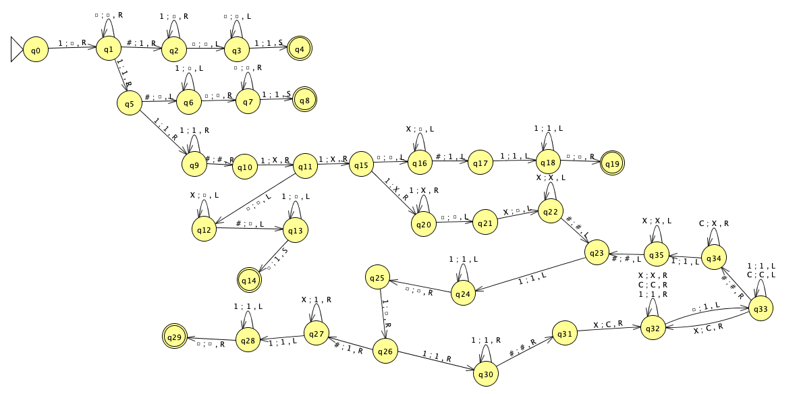
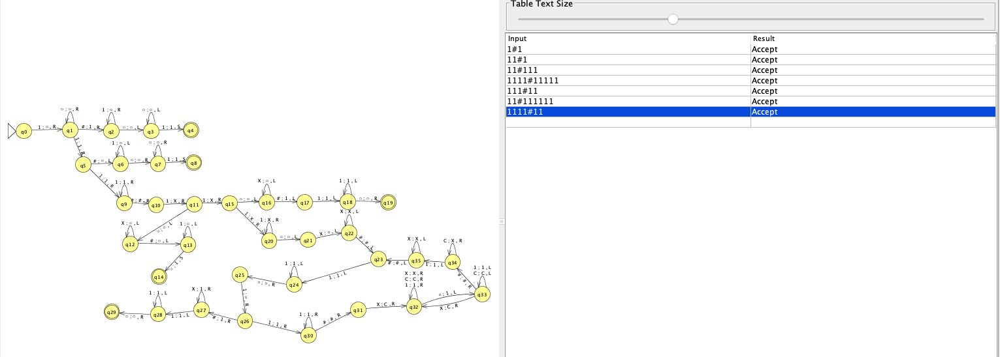

# **Máquina de Turing para la Multiplicación Unaria**

Se presenta una Máquina de Turing que realiza la multiplicación de dos números en representación unaria.

- **Nombre**: "Máquina de Turing para la Multiplicación Unaria"
- **Función que computa**:  
  La máquina toma dos números en unario, representados por secuencias de `1`s separadas por `#`, y calcula su producto en representación unaria.

**Ejemplos:**

| Entrada (unaria) | Salida (unaria) |
| ---------------- | --------------- |
| 111#11 (3×2)     | 111111 (6)      |
| 11#11 (2×2)      | 1111 (4)        |
| 111#111 (3×3)    | 111111111 (9)   |

## **Descripción y estrategia mejorada**

La máquina de Turing realiza la multiplicación de dos números representados en **notación unaria**. Cada número está formado por una secuencia de `1`s y está separado por el símbolo `#`. El objetivo es calcular el producto de estos dos números y escribir el resultado en la cinta, utilizando también notación unaria.

### **Estrategia general**

1. **Identificación de los factores**

   - Se escanea la entrada para localizar los dos operandos, identificando el primer número antes del `#` y el segundo después de este.

2. **Copia del primer operando**

   - Se recorre el primer operando (`n` cantidad de `1`s) y, por cada `1` encontrado, se inicia un proceso de copia del primer operando `m` veces, donde `m` es la cantidad de `1`s en el segundo operando.

3. **Uso de marcadores auxiliares (`X` y `C`)**

   - `X`: Se usa temporalmente para marcar los `1`s procesados y evitar contarlos nuevamente.
   - `C`: Se usa para indicar la finalización del proceso de copiado de un grupo de `1`s.

4. **Construcción del resultado**

   - Los `1`s copiados se reubican al final de la cinta, representando la multiplicación.
   - Se eliminan los marcadores auxiliares y cualquier otro carácter sobrante.

5. **Finalización y limpieza**
   - Una vez terminado el proceso de multiplicación, la máquina vuelve a su estado final y detiene la ejecución, dejando únicamente la respuesta en unario en la cinta.

### **Ejemplo de ejecución**

Para la entrada `111#11` (3 × 2):

1. Se reconoce `111` como el primer operando (`n = 3`) y `11` como el segundo (`m = 2`).
2. Se recorre `111`, y por cada `1` encontrado, se copia `111` nuevamente en la cinta.
3. Se eliminan los símbolos auxiliares, dejando `111111` como resultado (6 en unario).

Este enfoque garantiza que el resultado refleje correctamente la operación de multiplicación en un sistema de numeración sin ceros, basado únicamente en la cantidad de `1`s.

- **Formalismo**: MT = < Г, Σ, b, Q, q_0, F, δ>

  - **Alfabeto de la cinta**: Г = {1, #, X, C, b}
  - **Alfabeto de entrada**: Σ = {1, #}
  - **Símbolo blanco**: b = b
  - **Conjunto de estados**:  
    Q = {q0, q1, q2, q3, q4, q5, q6, q7, q8, q9, q10, q11, q12, q13, q14, q15, q16, q17, q18, q19, q20, q21, q22, q23, q24, q25, q26, q27, q28, q29, q30, q31, q32, q33, q34, q35}

  - **Estado inicial**: q0 = q0
  - **Estados finales**: F = {q4, q8, q14, q19, q29}
  - **Transiciones**:  
    δ = {

    - δ(q0, 1) = (q1, b, R)

    - δ(q1, #) = (q2, 1, R)
    - δ(q1, 1) = (q5, 1, R)
    - δ(q1, b) = (q1, b, R)

    - δ(q2, 1) = (q2, b, R)
    - δ(q2, b) = (q3, b, L)

    - δ(q3, 1) = (q4, 1, S)
    - δ(q3, b) = (q3, b, L)

    - δ(q5, #) = (q6, b, L)
    - δ(q5, 1) = (q9, 1, R)

    - δ(q6, 1) = (q6, b, L)
    - δ(q6, b) = (q7, b, R)

    - δ(q7, 1) = (q8, 1, S)
    - δ(q7, b) = (q7, b, R)

    - δ(q9, #) = (q10, #, R)
    - δ(q9, 1) = (q9, 1, R)

    - δ(q10, 1) = (q11, X, R)

    - δ(q11, 1) = (q15, X, R)
    - δ(q11, b) = (q12, b, L)

    - δ(q12, #) = (q13, b, L)
    - δ(q12, X) = (q12, b, L)

    - δ(q13, 1) = (q13, b, L)
    - δ(q13, b) = (q14, 1, S)

    - δ(q15, 1) = (q20, X, R)
    - δ(q15, b) = (q16, b, L)

    - δ(q16, #) = (q17, 1, L)
    - δ(q16, X) = (q16, b, L)

    - δ(q17, 1) = (q18, 1, L)

    - δ(q18, 1) = (q18, 1, L)
    - δ(q18, b) = (q19, b, R)

    - δ(q20, 1) = (q20, X, R)
    - δ(q20, b) = (q21, b, L)

    - δ(q21, X) = (q22, b, L)

    - δ(q22, #) = (q23, #, L)
    - δ(q22, X) = (q22, X, L)

    - δ(q23, 1) = (q24, 1, L)

    - δ(q24, 1) = (q24, 1, L)
    - δ(q24, b) = (q25, b, R)

    - δ(q25, 1) = (q26, b, R)

    - δ(q26, #) = (q27, 1, R)
    - δ(q26, 1) = (q30, 1, R)

    - δ(q27, 1) = (q28, 1, L)
    - δ(q27, X) = (q27, 1, R)

    - δ(q28, 1) = (q28, 1, L)
    - δ(q28, b) = (q29, b, R)

    - δ(q30, #) = (q31, #, R)
    - δ(q30, 1) = (q30, 1, R)

    - δ(q31, X) = (q32, C, R)

    - δ(q32, 1) = (q32, 1, R)
    - δ(q32, C) = (q32, C, R)
    - δ(q32, b) = (q33, 1, L)
    - δ(q32, X) = (q32, X, R)

    - δ(q33, #) = (q34, #, R)
    - δ(q33, 1) = (q33, 1, L)
    - δ(q33, C) = (q33, C, L)
    - δ(q33, X) = (q32, C, R)

    - δ(q34, 1) = (q35, 1, L)
    - δ(q34, C) = (q34, X, R)

    - δ(q35, #) = (q23, #, L)
    - δ(q35, X) = (q35, X, L)
      }

- **Diseño en JFlap**: 
- **Comprobaciones**:
  
- **Programa Simulator**: [Programa Simulator](http://turingmachinesimulator.com/shared/vitfcuxush)
- **Programa Prolog**: [Programa Prolog](./resources/multiplicacion_unario.pl)

# **Cálculo de Complejidades en la Máquina de Turing**

Se evalúa la complejidad **espacial** y **temporal** de la máquina de Turing utilizando datos de entrada. A partir de estos, se pueden obtener fórmulas matemáticas que describen su comportamiento.

### Complejidad Espacial

Para los casos base usamos la siguientes formulas:

- S(n,m) = { si (n = 0 ∨ n = 1 ) -> m + 4}
- S(n,m) = { si n > 0 ∧ (m = 0 ∨ m=1 ) -> n + 5 }

Y para el caso de multiplicacion donde n es mayor a 1 y m es mayor a 1:

- S(n,m) ={ si n,m >1 ∧ n\*m }

### Complejidad Temporal

La complejidad temporal para esta máquina solo se puede calcular de forma exacta cuando _n_ o _m_ valen 0(1u) o 1(11u)

Cuando _n_ y _m_ son mayores a 1 no se puede calcular de forma exacta la cantidad de pasos que le toma la maquina de Turing computar ya que es alealtoria

- **CAS0 base “n=0”**

  - T(n,m) = { si n = 0 -> (2\*m)+5 }

- **CAS0 base “n=1”**

  - T(n,m) = { si n = 1 -> 7}

- **CAS0 base “ n > 1 ∧ m=0”**

  - T(n,m) = { si n >1 ∧ m=0 -> 2\*n +6}

- **CAS0 base “ n > 1 ∧ m=1”**

  - T(n,m) = { si n >1 ∧ m=1 -> 2\*n + 9}

- **CAS0S donde “ n , m > 1”**

Para estos casos el incremento de los pasos es alealtorio, no sigue un orden lineal

| Multiplicación unaria | Pasos (tiempo) |
| --------------------- | -------------- |
| 111x111               | 45             |
| 111#1111              | 61             |
| 111#11111             | 81             |
| 1111#111              | 78             |
| 1111#1111             | 116            |
| 1111#11111            | 166            |
